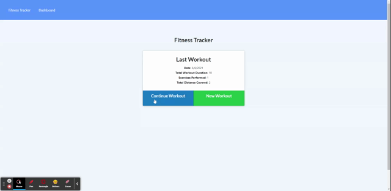

# Fitness Tracker
Fitness Tracker application utilizing MongoDB

## Table of Contents
- [Description](#description)
- [Installation](#installation)
- [Usage](#usage)
- [License](#license)
- [Contributors](#contributors)
- [Questions](#questions)

## Description
This is a full-stack application to track and graph exercises and workouts utilizing MongoDB

The deployed application can be located at: https://cbmfitness-tracker.herokuapp.com/

### Screenshot:   

### Features
* Utilizes MongoDB for flexibility with exercise types - both Cardio and Resistance exercises are supported

## Installation Instructions
To install this application, please follow the below instructions:  
1.  Clone or download .zip file from Github to your local computer
2.  In Git Bash or Terminal, type `npm install` to install the necessary modules
3.  Update the information in `.env.EXAMPLE` with your username (root is default) and password and rename the file as `.env`
4.  Type `npm run seed` in your terminal to seed the database
5.  When ready, type `npm start` in your terminal to launch `server.js`
6.  Navigate to `localhost:3000` or, if a different port is specified in your `.env` file, use that port

## Usage
Use this to track both resistance and cardio exercises to view details of your workout progress

## License 
This project is licensed under the MIT License. Click the link below to learn more about how you can use this project.  
License: [MIT License](https://opensource.org/licenses/MIT)

## Contributors
Many thanks to those that contributed to this project:
* Mim Armand
* Kat Poulos
* Andrew Hardemon
* Jay Yousef
* And last, but not least - *Grogu*  

## Questions
### Questions or issues?  
Questions or issues should be raised either by emailing the developer at the links below or creating an Issue within Github using the Issues button at the top of the repository
### To contact me:
* Github: [cbmartinez42](https://github.com/cbmartinez42)  
* Email: [cbmartinez42@gmail.com](mailto:cbmartinez42@gmail.com)